<div align="center">

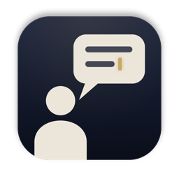

# Lecture Transcriber (강의 받아쓰기)

<p><a href="README.md">한국어</a> · <b>English</b></p>

**A Mac app that transcribes online lectures in real time**<br>
Apple on-device speech recognition · free · open source · everything stays on your Mac

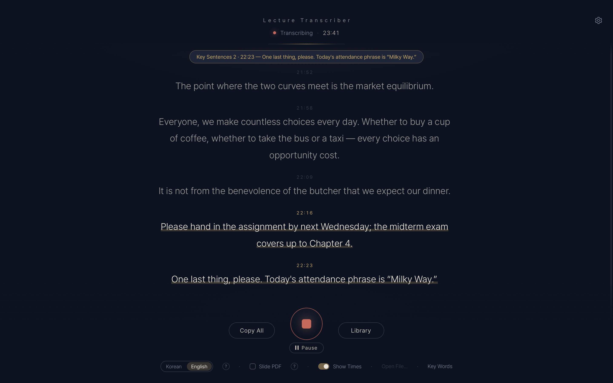

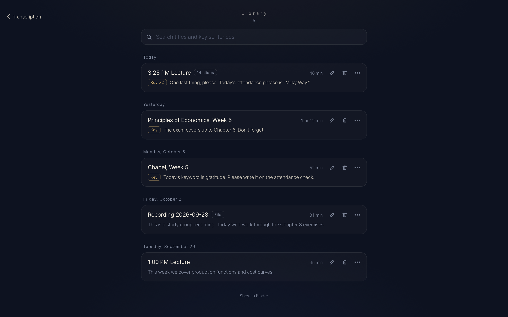

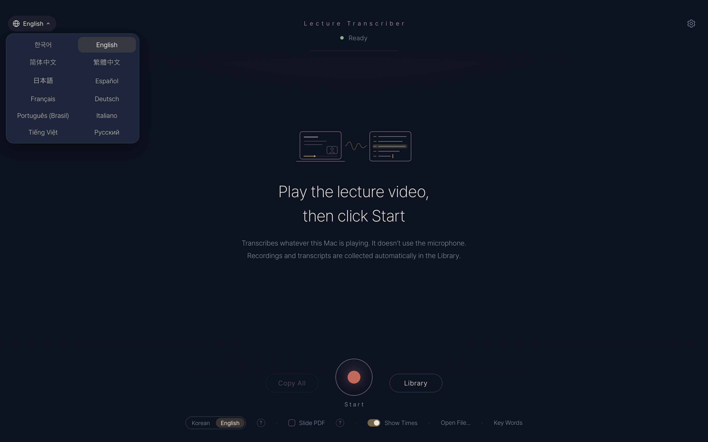

<sub>The app speaks 12 languages — Korean, English, Simplified and Traditional Chinese, Japanese, Spanish, French, German, Portuguese (Brazil), Italian, Vietnamese and Russian. It follows your Mac's language (English for any other), and the globe on the start screen switches it.</sub>

</div>

## Features

- **Speech recognition:** transcribes on your Mac with **Apple's on-device speech recognition (SpeechAnalyzer)**, built into macOS. There is nothing to download, and the lecture never leaves your Mac.
- **Other speech engines (optional).** Download one once in Settings › Speech Recognition to use it instead of Apple's. All run entirely on your Mac, and you can delete them when you no longer need them. (They use more power than Apple's.)
  - **Qwen3-ASR** (Alibaba's open model, about 1.5 GB) — the most accurate for lectures that mix Korean and English and for strongly accented English. (It may spell foreign names in English letters inside Korean sentences, write a very strongly Korean-accented short English line in Hangul, or turn unclear short Korean speech into made-up English. Japanese spoken in an English lecture comes out as Korean.)
  - **Whisper large-v3 turbo** (OpenAI's open model, about 575 MB)
  - **Parakeet** (NVIDIA's open model, about 540 MB) — for English lectures only. Korean speech is dropped or comes out as made-up English. The fastest and lightest of the downloadable engines.
- **Transcribes whatever your Mac is playing.** LearnUs, YouTube, Zoom — just play it. It never uses the microphone, so you can wear earphones and background noise doesn't matter.
- **Words appear as they are spoken.** When you stop, a text file (`.txt`) and a recording (`.m4a`) are saved automatically to `Downloads/Lecture Transcriber` (`Downloads/강의기록` if that folder already existed or the app was in Korean when it first opened; the folder is chosen once).
- **Library** — each lecture's recording and transcript in one place inside the app. Click a sentence to play from there; important sentences are collected at the top. Every session shows rename and delete buttons right on it; its ⋯ button (or a right-click) has share too, and you can search them all. Inside a session, ⌘F finds words, and **Edit Text** fixes a misheard word in place (the recording is left as it is).
- **Pause.** In a break, click **Pause** under the start button. Nothing is recorded or transcribed meanwhile; **Resume** carries on in the same session.
- **Safe from a stray ⌘Q.** Quitting or closing the window mid-lecture asks first, and whatever was recorded and transcribed until then is saved either way.
- **Playback speed.** It keeps up with lectures played at 1.5× or 2×.
- **Copy All** copies the whole transcript in one click, ready to paste into an AI such as ChatGPT or Claude for a summary.
- **English lectures.** Choose the lecture language under the start button: **Korean / English**. An English lecture is transcribed in English, and Korean said in between is written in Korean where possible. Apple's recognizer can miss Korean remarks in an English lecture (short ones most often); Qwen3-ASR catches more of them.
- **Strong accents.** A strong accent can make the recognizer hear the other language (for example, strongly accented English written in Hangul). For an English lecture, switch to **English** before you start. With a very strong accent Apple's recognizer can still get it wrong; use **Qwen3-ASR** then — it is the most accurate on accented English. (Qwen3-ASR can also get short phrases wrong in a very noisy recording.)
- **English stays English.** Nothing is translated on purpose. (A very short English reply such as "Good question." can occasionally come out in Korean.) Apple's recognizer can miss a short English quote between Korean sentences entirely; if English quotes matter (exam phrases, for example), use Qwen3-ASR.
- **Important sentences** — sentences containing words such as attendance, exam or assignment (and their Korean counterparts 출석, 시험, 과제) are underlined and collected at the end of the saved file. You choose the words.
- **File transcription** — drop an audio or video file onto the window to transcribe it much faster than real time. (For a one-hour lecture: about 1–2 minutes with Apple or Parakeet, 15–30 minutes with Whisper or Qwen3-ASR; longer when English is mixed in or the speech pauses often.)
- **Slide PDF** — for classes that don't share their slides, check Slide PDF. Each time the slide changes, it is captured and put into a PDF together with what was said while it was on screen. A slide that fills in line by line is kept once, fully filled in, and the lecturer's camera is ignored: the app finds it by itself and outlines it on the live screen. (Mac: pick the lecture window · iPhone/Mac: also from video files)
- **PDF layout.** Choose it in Settings › PDF Layout: **Landscape** (the default — each slide fills a landscape page, and what was said follows on the next page) · **Two Files** (a PDF of the slides and a separate transcript PDF) · **A4 Page** (slide and transcript together on an A4 page, the earlier layout). Each slide is named with the title read from the slide (for example "Slide 3 · Supply and Demand"), and the PDF's bookmarks take you straight to any slide. The titles are read on your Mac, too.
- **Clean capture (on by default).** Parts that stay the same all lecture long — the browser's address bar, the player's controls, black borders — are left out: the app finds the part that changes when the slide turns and puts only that into the PDF. If a new place starts changing later, the area grows again, and a page with content outside the area (a slide wider than the others, say) keeps its whole picture. Turn it on or off right on the recording screen (or Settings › Clean Capture).
- **See it working.** With Slide PDF on, choose **Screen** (the lecture window large, the transcript below) or **Text** (the transcript large, the window as a card) with the switch at the top. What goes into the PDF is outlined in red and the lecturer's camera in white, and each slide taken flashes like a screenshot and flies into the page count.
- **12 interface languages.** The whole app — screens, menus, notices and PDFs — is available in 한국어 · English · 简体中文 · 繁體中文 · 日本語 · Español · Français · Deutsch · Português (Brasil) · Italiano · Tiếng Việt · Русский. It follows your Mac's (iPhone's) language at first — English when the device is set to a language the app doesn't speak — and the globe at the top left of the start screen or Settings › Language switches it. (The lecture language — what is being transcribed — is set separately: Korean or English. Saved file names and headers are Korean in the Korean interface and English in every other.)

<p align="center">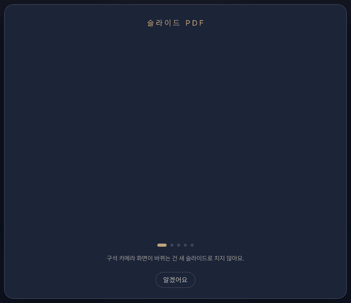</p>

## Screenshots

<table>
<tr><td>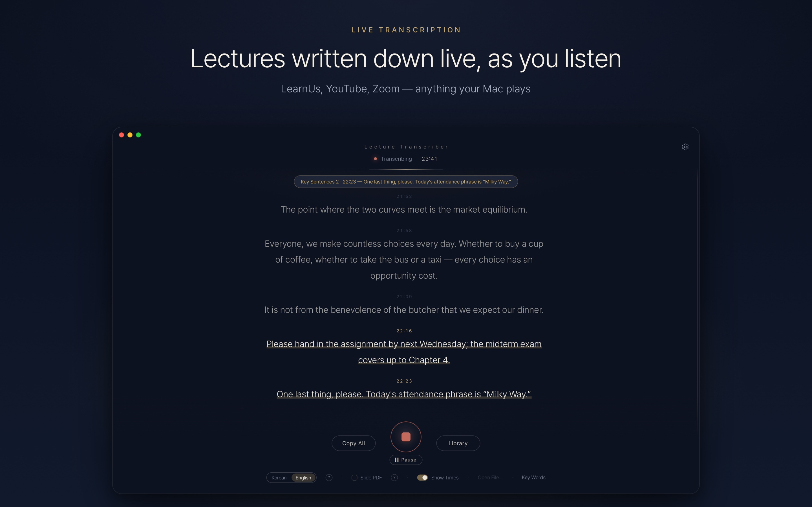</td><td>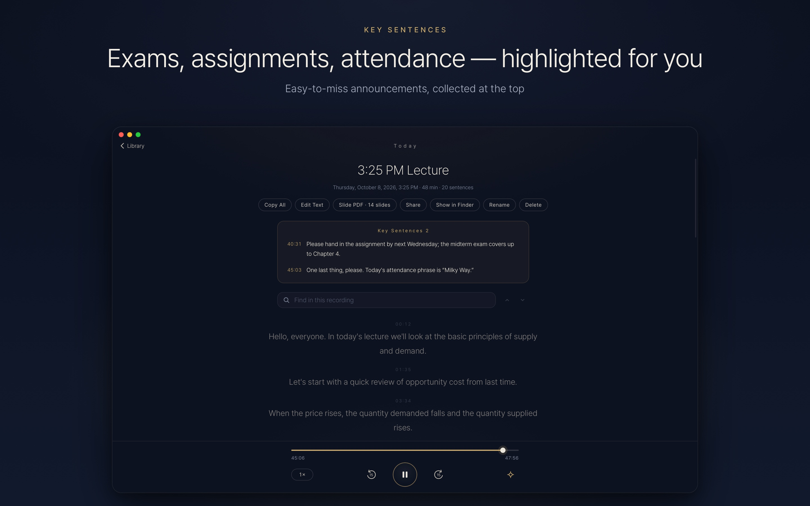</td></tr>
<tr><td>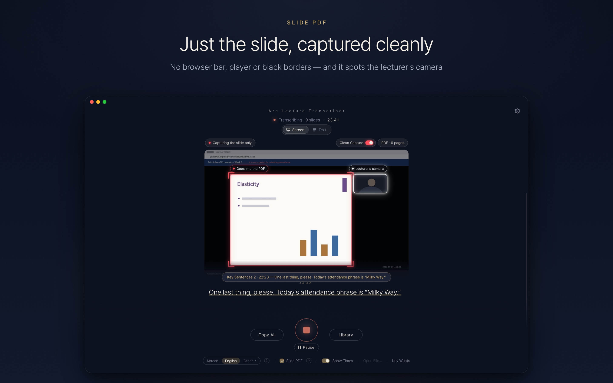</td><td>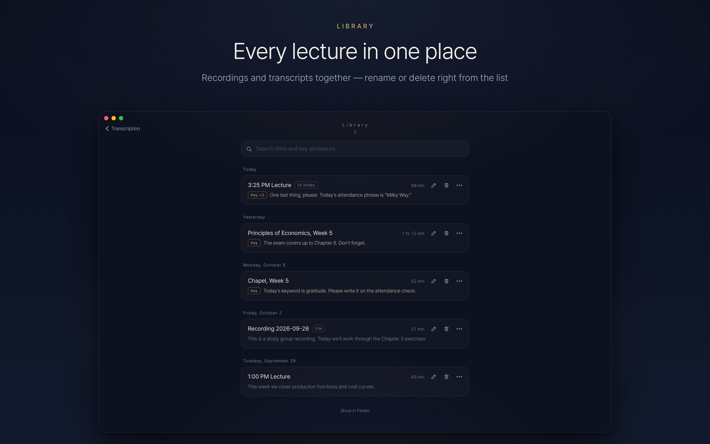</td></tr>
<tr><td>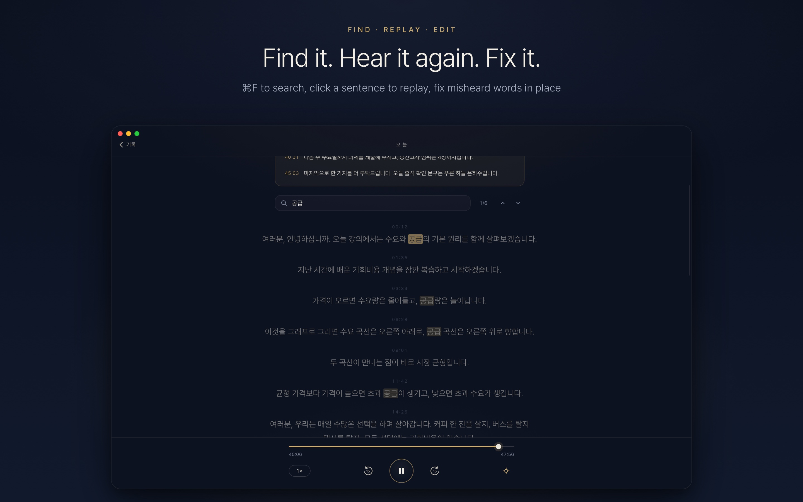</td><td>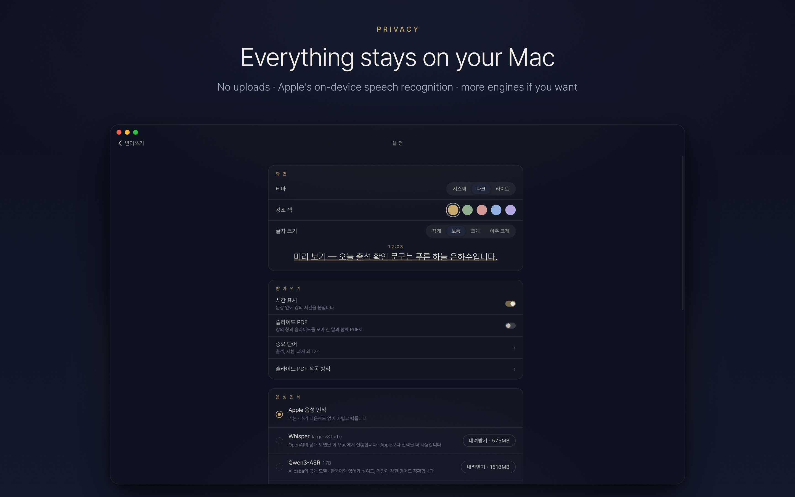</td></tr>
</table>

## Requirements

- **macOS 26 (Tahoe) or later** on an Apple Silicon (M1 or later) Mac
- On macOS 14.2–15, use [v1 (the Whisper version)](https://github.com/WeldingArc/lecture-transcriber/releases/tag/v1.0.0). The install command below picks the right version for your macOS automatically.

## Install

### Option 1 · One line in Terminal

Open the **Terminal** app (search "Terminal" in Spotlight), paste this line and press Enter:

```bash
curl -fsSL https://raw.githubusercontent.com/WeldingArc/lecture-transcriber/main/scripts/install.sh | bash
```

Run the same line again to update.

### Option 2 · Download

Download `LectureScribe-mac.zip` from the [latest release](https://github.com/WeldingArc/lecture-transcriber/releases/latest), unzip it, and move `강의 받아쓰기.app` (Finder shows it as Lecture Transcriber on a Mac set to any language but Korean) to your Applications folder. The app is not notarized yet, so if you downloaded it with a browser, macOS blocks it the first time ("Apple could not verify…"): click **Done**, then open **System Settings › Privacy & Security**, scroll down and click **Open Anyway** (once). The installer command in Option 1 doesn't need this step.

## First launch

On first launch the app shows a **Usage Notice and Disclaimer**. Read it and click **Agree and Start**. The first time you click **Start**, macOS asks for **"System Audio Recording"** permission → **Allow**. (If the Korean speech model isn't on your Mac yet, macOS downloads it once.)

## How to use

1. Play the lecture and click **Start**
2. When it ends, click **Stop** → the text and recording are saved
3. Open past lectures in **Library** to listen again, or paste them into an AI with **Copy All**

- **Transcribe a file:** drop an audio or video file onto the window, or use **Open File…**
- **Change the key words:** **Key Words** at the bottom
- **Slide PDF layout:** Settings › PDF Layout (Landscape · Two Files · A4 Page)
- **While recording:** the **Screen · Text** switch at the top (Screen for the large view, Text for the small card)
- **Interface language:** the globe at the top left of the start screen, or Settings › Language (12 languages)
- **Shortcuts:** ⌘R start/stop · ⌘P pause/resume · ⌘F find in a session · ⌘O open a file · ⌘⇧C copy everything (also in the menu bar: Record, and Edit › Find…)

## Good to know

- **For personal study.** Sharing or distributing lecture recordings or transcripts can raise copyright and portrait-right issues and may break your school's rules. See the usage notice and disclaimer below.
- Transcription is not perfect. Proper nouns such as names, and numbers (e.g. 4장 "chapter 4" heard as 사장 "president"), can be wrong, so check anything important against the recording.

## Usage notice and disclaimer

Lecture Transcriber is a tool to support personal study. On first launch you must agree to the following before using the app; you can read it again under Settings › About › Usage Notice and Disclaimer, or from the Help menu.

- Lectures, slides and transcripts you record or transcribe with this app remain the copyright of their owners, such as the lecturer and the university.
- Use recordings, transcripts and slide PDFs only for your own study. Sharing or distributing them, or posting them online, may infringe copyright.
- Before recording, check your course's recording policy and the lecturer's wishes.
- You alone are responsible for any legal consequences of using the app; the developer accepts no liability.
- Transcripts can contain errors. Check anything important against the original lecture.

## FAQ

<details>
<summary>I clicked Start but no text appears</summary>

Make sure the lecture is actually playing. If text still doesn't appear, open **System Settings → Privacy & Security → Screen & System Audio Recording**, turn on Lecture Transcriber (강의 받아쓰기 on a Mac set to Korean) in the **"System Audio Recording Only"** list, and reopen the app.
</details>

<details>
<summary>I updated from v1</summary>

Transcripts made with v1 stay in the `강의기록` folder in your home folder. From v2 on, they are saved in your Downloads folder (because of Apple's sandbox): `Downloads/강의기록`, or `Downloads/Lecture Transcriber` when the app first opens in any language but Korean.

The Whisper model v1 used (570 MB) is no longer needed. To free the space, run this in Terminal:

```bash
rm -rf ~/Library/Application\ Support/LectureScribe/models
```
</details>

<details>
<summary>I want to uninstall the app</summary>

Move the app to the Trash, then delete the `~/Library/Containers/io.github.joshichoi.lecture-scribe` folder, which holds the settings and any downloaded speech models. To delete only a model, click Delete in Settings › Speech Recognition. Your transcripts stay in `Downloads/Lecture Transcriber` (or `Downloads/강의기록`).
</details>

<details>
<summary>Something went wrong</summary>

Attach `app.log` from **Help → Open Log Folder (for Reporting Problems)** to an [issue](https://github.com/WeldingArc/lecture-transcriber/issues). The log contains neither your transcripts nor your Mac user name.
</details>

## How it works

```
Mac system audio ─▶ Core Audio tap (macOS 14.2+) ─▶ Apple SpeechAnalyzer
                                                   ├─ Korean recognition (live preview + final sentences)
                                                   └─ English recognition → English quotes kept, placed by word timing and confidence
                                               ─▶ the window + Downloads/Lecture Transcriber or 강의기록 (.txt, .m4a)
```

When you choose another engine, a small runtime inside the app — **whisper.cpp** for Whisper, **transcribe.cpp** for Qwen3-ASR and Parakeet — transcribes with the downloaded model instead of SpeechAnalyzer. A voice-activity detector (Silero VAD) splits the audio at pauses, English quotes stay in English (Qwen3-ASR reads a piece again in two halves when it looks translated or seems to have dropped words), and made-up phrases (such as "Thank you for watching") and repeats are filtered out.

It is a single native Swift app (AppKit + WKWebView) that runs in Apple's sandbox. The app is about 17 MB (speech models are downloaded only if you choose one). To build it yourself, see [DEVELOPMENT.md](DEVELOPMENT.md).

**v1** ran OpenAI Whisper large-v3-turbo with whisper.cpp. It remains available for macOS 14.2–15 as the [v1.0.0 release](https://github.com/WeldingArc/lecture-transcriber/releases/tag/v1.0.0).

## License

MIT. Third-party software and licenses are listed in [THIRD_PARTY_NOTICES.md](THIRD_PARTY_NOTICES.md); the privacy policy is in [PRIVACY.md](PRIVACY.md).
