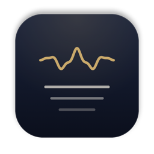

<div align="center">



# 강의 받아쓰기

**온라인 강의를 실시간으로 받아 적어 주는 Mac 앱**<br>
무료 · 오픈소스 · 모든 처리가 내 Mac 안에서


</div>

## 이런 앱이에요

- **Mac에서 나오는 소리를 그대로 받아 적어요.** 런어스·유튜브·줌 등 무엇이든 재생만 하면 돼요. 마이크는 쓰지 않아서 이어폰을 껴도 되고 주변이 시끄러워도 괜찮아요.
- **실시간 자막처럼** 문장 단위로 받아 적고, 끝나면 텍스트(`.txt`)와 녹음(`.m4a`)을 자동으로 저장해요.
- **배속 재생도 OK.** 1.5배속은 거의 그대로, 2배속도 따라가요.
- **[전체 복사]** 한 번이면 ChatGPT·Claude 같은 AI에 붙여 넣어 요약·정리할 수 있어요.
- **영어로 말하는 부분은 영어 그대로** 적어요. 번역하지 않아요.
- **중요 문장 표시** — '출석', '시험', '과제' 같은 단어가 나온 문장에 밑줄을 긋고, 저장 파일 끝에 따로 모아 줘요. 단어는 직접 바꿀 수 있어요.
- **개인정보 걱정 없음** — 음성 인식은 전부 Mac의 GPU에서 처리돼요. 녹음과 텍스트는 어디로도 전송되지 않고, 사용 통계도 보내지 않아요. 인터넷은 처음 한 번 AI 모델을 받을 때만 써요.

## 필요한 것

- **Apple Silicon Mac** (M1 이상) · **macOS 14.2 (Sonoma)** 이상
- 저장 공간 약 **1GB** (AI 모델 574MB + 앱 약 70MB + 녹음 1시간에 약 15MB)
- Intel Mac과 Windows는 지원하지 않아요.
- macOS 14.2 이상에서 돌아가도록 빌드했지만, 개발은 최신 macOS에서 했어요. 14·15에서 문제가 있으면 [이슈](https://github.com/JoshiChoi/lecture-scribe/issues)로 알려 주세요.

## 설치

### 방법 1 · 터미널 한 줄 (추천)

**터미널** 앱(Spotlight에서 "터미널" 검색)을 열고 아래 한 줄을 붙여 넣은 뒤 Enter:

```bash
curl -fsSL https://raw.githubusercontent.com/JoshiChoi/lecture-scribe/main/scripts/install.sh | bash
```

최신 버전을 내려받아 응용 프로그램 폴더에 넣고 바로 열어 줘요. 업데이트할 때도 같은 줄을 다시 실행하면 돼요.

### 방법 2 · 직접 다운로드

1. [최신 릴리스](https://github.com/JoshiChoi/lecture-scribe/releases/latest)에서 `LectureScribe-mac.zip`을 받아 압축을 풀고, `강의 받아쓰기.app`을 응용 프로그램 폴더로 옮겨요.
2. 처음 열면 "Apple이 확인할 수 없음" 경고가 떠요. 유료 Apple 개발자 인증을 받지 않은 무료 앱이라서 그래요.
   **시스템 설정 → 개인정보 보호 및 보안**에서 아래쪽 **"그래도 열기"**를 누르면 돼요.

## 처음 실행할 때

1. AI 모델(약 570MB)을 **한 번만** 내려받아요. 진행률이 표시되고, 끊겨도 이어서 받아요. 그다음 엔진 준비에 20초쯤 걸릴 수 있어요 (처음 한 번).
2. 처음 **[시작]**을 누르면 macOS가 **"시스템 오디오 녹음"** 권한을 물어봐요 → **허용**.

## 사용법

1. 강의 영상을 재생하고 **[시작]**
2. 끝나면 **[정지]** → `~/강의기록` 폴더에 텍스트와 녹음이 저장돼요
3. **[전체 복사]**로 AI에 붙여 넣거나, **[기록 폴더]**에서 파일을 열어요

- **파일 받아쓰기:** 녹음·영상 파일을 창에 끌어다 놓거나 [파일 불러오기]
- **중요 단어 바꾸기:** 아래쪽 [중요 단어]
- **단축키:** ⌘⇧C 전체 복사

## 꼭 읽어 주세요

- **개인 공부용으로 만들었어요.** 강의 녹음이나 녹취록을 다른 사람과 공유·배포하면 저작권·초상권 문제가 생길 수 있고 학교 규정에 어긋날 수 있어요.
- 받아쓰기는 완벽하지 않아요. 특히 이름 같은 고유명사는 틀릴 수 있으니, 중요한 내용은 녹음으로 확인하세요.

## 자주 묻는 질문

<details>
<summary>[시작]을 눌렀는데 글자가 안 나와요</summary>

강의 영상이 실제로 재생 중인지 확인하세요. 그래도 안 되면 **시스템 설정 → 개인정보 보호 및 보안 → 화면 및 시스템 오디오 녹음**의 **"시스템 오디오 녹음만"** 목록에서 강의 받아쓰기를 켠 뒤 앱을 다시 열어 주세요.
</details>

<details>
<summary>노트북이 따뜻해져요</summary>

음성 인식에 GPU를 쓰기 때문이에요. 쉬는 동안에는 10분 뒤 AI 모델을 메모리에서 내려서 자원을 거의 쓰지 않아요.
</details>

<details>
<summary>지우고 싶어요</summary>

터미널에 아래 한 줄을 붙여 넣으면 앱과 AI 모델(570MB), 설정이 모두 지워져요. 받아 적은 기록(`~/강의기록`)은 남아요.

```bash
rm -rf "/Applications/강의 받아쓰기.app" "$HOME/Applications/강의 받아쓰기.app" ~/Library/Application\ Support/LectureScribe ~/Library/Caches/io.github.joshichoi.lecture-scribe ~/Library/WebKit/io.github.joshichoi.lecture-scribe ~/Library/HTTPStorages/io.github.joshichoi.lecture-scribe ~/Library/Preferences/io.github.joshichoi.lecture-scribe.plist ~/Library/Saved\ Application\ State/io.github.joshichoi.lecture-scribe.savedState
```
</details>

<details>
<summary>문제가 생겼어요</summary>

메뉴 **도움말 → 로그 폴더 열기 (문제 신고용)**에서 `backend.log`를 첨부해 [이슈](https://github.com/JoshiChoi/lecture-scribe/issues)로 알려 주세요. 로그에는 받아 적은 내용도, Mac 사용자 이름도 들어가지 않아요.
</details>

## 어떻게 동작하나요

```
Mac 시스템 소리 ─▶ Core Audio 탭 (macOS 14.2+) ─▶ Silero VAD(NumPy)로 문장 단위 분할
                                              ─▶ whisper.cpp · Whisper large-v3-turbo (Metal GPU)
                                              ─▶ 문장마다 한국어/영어 판별 ─▶ 화면 + ~/강의기록
```

Swift(AppKit + WKWebView) 앱과 Python 엔진으로 되어 있어요. 직접 빌드하려면 [DEVELOPMENT.md](DEVELOPMENT.md)를 보세요.

## 라이선스

MIT. 사용한 오픈소스와 라이선스는 [THIRD_PARTY_NOTICES.md](THIRD_PARTY_NOTICES.md)에 있어요.

---

## English

**강의 받아쓰기 (Lecture Scribe)** is a free, open-source Mac app that live-transcribes whatever lecture is playing on your Mac (LearnUs, YouTube, Zoom…). It captures system audio directly (no microphone), transcribes Korean and English locally with Whisper large-v3-turbo on the GPU, and saves a text file plus an audio recording when you stop. English speech is written as English, never translated. Sentences containing keywords you choose (e.g. attendance, exam, assignment) are highlighted and collected at the end. Nothing leaves your Mac; the only network use is a one-time model download.

**Requirements:** Apple Silicon (M1+), macOS 14.2+, ~1 GB free disk.
**Install:** `curl -fsSL https://raw.githubusercontent.com/JoshiChoi/lecture-scribe/main/scripts/install.sh | bash` — or download the zip from [Releases](https://github.com/JoshiChoi/lecture-scribe/releases/latest) and use System Settings → Privacy & Security → "Open Anyway" on first launch.
**Please** use it for personal study only and respect your instructors' rights and your school's recording policy.
