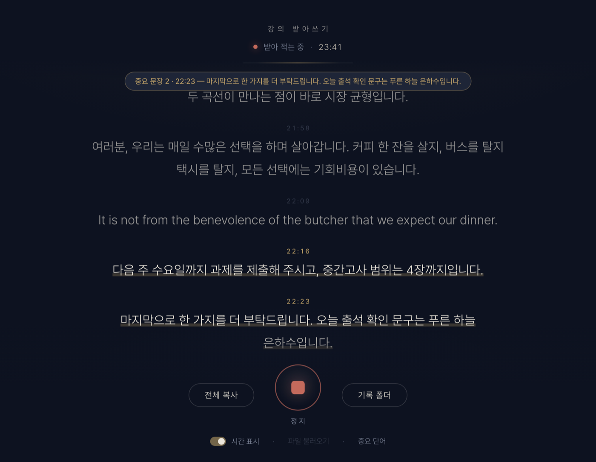
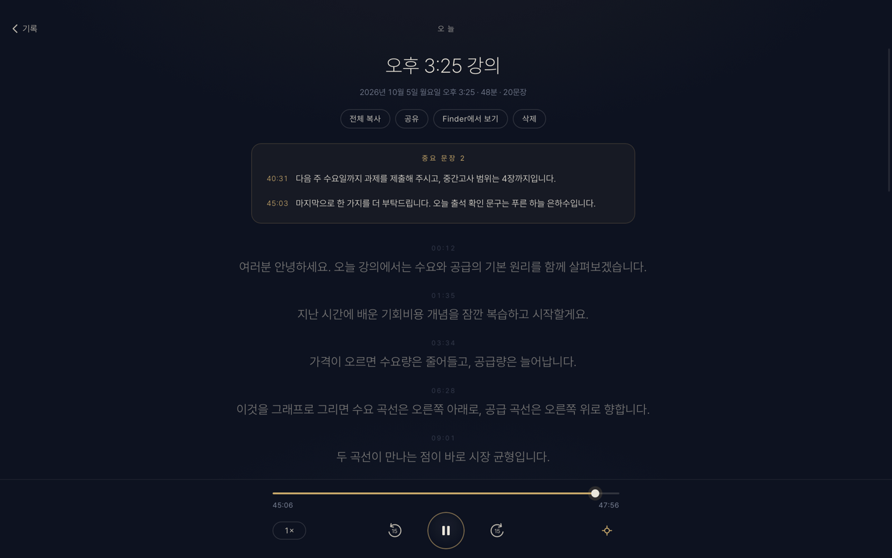

<div align="center">


# 강의 받아쓰기

**온라인 강의를 실시간으로 받아 적어 주는 Mac 앱**<br>
Apple 온디바이스 음성 인식 · 무료 · 오픈소스 · 모든 처리가 내 Mac 안에서





</div>

## 이런 앱이에요

- **음성 인식:** Apple이 macOS에 넣어 둔 **온디바이스 음성 인식(SpeechAnalyzer)**으로 Mac 안에서 바로 받아 적어요. 따로 내려받을 게 없고, 강의 내용이 밖으로 나가지 않아요.
- **다른 음성 인식 엔진도 고를 수 있어요(선택).** ‘설정 › 음성 인식’에서 한 번 내려받으면 Apple 대신 쓸 수 있어요. 모두 Mac 안에서만 돌아가고, 필요 없으면 지우면 돼요. (Apple보다 전력을 더 써요.)
  - **Qwen3-ASR** (Alibaba의 공개 모델, 약 1.5GB) — 한국어와 영어가 섞인 강의, 억양이 강한 영어에 가장 정확해요. (한국어 문장 속 외국 사람 이름은 영어 철자로 적기도 하고, 한국어 억양이 아주 강한 짧은 영어 문장은 한글로, 또렷하지 않은 짧은 한국어 말은 엉뚱한 영어로 적을 때도 있어요. 영어 강의 중의 일본어는 한국어로 적혀요)
  - **Whisper large-v3 turbo** (OpenAI의 공개 모델, 약 575MB)
  - **Parakeet** (NVIDIA의 공개 모델, 약 540MB) — 영어 강의 전용이에요. 한국어로 한 말은 빠지거나 엉뚱한 영어로 적혀요. 내려받는 엔진 중 가장 빠르고 가벼워요.
- **Mac에서 나오는 소리를 그대로 받아 적어요.** 런어스·유튜브·줌 등 무엇이든 재생만 하면 돼요. 마이크는 쓰지 않아서 이어폰을 껴도 되고 주변이 시끄러워도 괜찮아요.
- **말하는 대로 글자가 바로 나타나요.** 끝나면 텍스트(`.txt`)와 녹음(`.m4a`)을 `다운로드/강의기록`에 자동으로 저장해요.
- **기록** — 강의마다 녹음과 받아 적은 글이 앱 안에 한곳으로 모여요. 문장을 누르면 그 부분부터 다시 들려주고, ‘중요 문장’은 맨 위에 모아 보여 줘요. 이름 바꾸기·검색·공유도 돼요.
- **배속 재생도 OK.** 1.5배·2배속도 따라가요.
- **[전체 복사]** 한 번이면 ChatGPT·Claude 같은 AI에 붙여 넣어 요약·정리할 수 있어요.
- **영어 강의도 OK.** 시작 버튼 아래에서 강의 언어를 **한국어 / English** 중에 고르세요. 영어 강의면 영어로 받아 적고, 중간에 한국어로 하는 말도 한국어로 적으려고 해요 — 다만 Apple 음성 인식은 영어 강의 중의 한국어 말을 놓칠 때가 있어요(짧을수록 자주 · Qwen3-ASR이 더 잘 잡아요).
- **억양이 강하면 주의하세요.** 말하는 사람의 억양이 강하면 다른 언어로 잘못 들릴 수 있어요(예: 억양이 강한 영어가 한글로 적히는 식). 영어 강의라면 시작 전에 **English**로 바꿔 주세요. 억양이 아주 강하면 그래도 Apple 음성 인식은 엉뚱하게 적을 수 있으니, 그럴 땐 **Qwen3-ASR**을 쓰세요 — 억양이 강한 영어도 가장 정확하게 받아 적어요. (Qwen3-ASR도 아주 시끄러운 녹음에서는 짧은 말을 엉뚱하게 적을 수 있어요.)
- **영어로 말하는 부분은 영어 그대로** 적어요. 일부러 번역하지 않아요. (“Good question.” 같은 아주 짧은 영어 대답은 가끔 한국어로 적힐 수 있어요) 다만 Apple 음성 인식은 한국어 문장 사이에 끼인 짧은 영어 인용을 통째로 놓칠 때가 있어요 — 영어 인용(시험에 나올 표현 같은)을 꼭 받아 적어야 하면 Qwen3-ASR을 쓰세요.
- **중요 문장 표시** — ‘출석’, ‘시험’, ‘과제’ 같은 단어가 나온 문장에 밑줄을 긋고, 저장 파일 끝에 따로 모아 줘요. 단어는 직접 바꿀 수 있어요.
- **파일 받아쓰기** — 녹음·영상 파일을 창에 끌어다 놓으면 재생 시간보다 훨씬 빨리 받아 적어요. (1시간 강의 기준 Apple·Parakeet은 1~2분, Whisper·Qwen3-ASR은 15~30분쯤 — 영어가 섞이거나 말이 자주 끊기면 더 걸려요)
- **슬라이드 PDF** — 강의 자료를 안 주는 수업이라면 ‘슬라이드 PDF’에 체크하세요. 슬라이드가 바뀔 때마다 한 장씩 찍어, 그동안 한 말과 함께 PDF로 모아 줘요. 글자가 하나씩 늘어나는 슬라이드는 다 채워진 모습으로 한 장만, 구석 카메라 화면이 바뀌는 건 무시해요. (Mac: 강의 창을 골라서 · iPhone/Mac: 영상 파일에서도)

<p align="center"></p>

## 필요한 것

- **macOS 26 (Tahoe) 이상**, Apple Silicon(M1 이상) Mac
- macOS 14.2~15라면 [v1(Whisper 버전)](https://github.com/WeldingArc/lecture-transcriber/releases/tag/v1.0.0)을 쓰세요. 아래 설치 명령은 macOS 버전에 맞는 걸 알아서 골라요.

## 설치

### 방법 1 · 터미널 한 줄

**터미널** 앱(Spotlight에서 "터미널" 검색)을 열고 아래 한 줄을 붙여 넣은 뒤 Enter:

```bash
curl -fsSL https://raw.githubusercontent.com/WeldingArc/lecture-transcriber/main/scripts/install.sh | bash
```

업데이트할 때도 같은 줄을 다시 실행하면 돼요.

### 방법 2 · 직접 다운로드

[최신 릴리스](https://github.com/WeldingArc/lecture-transcriber/releases/latest)에서 `LectureScribe-mac.zip`을 받아 압축을 풀고, `강의 받아쓰기.app`을 응용 프로그램 폴더로 옮기세요.

## 처음 실행할 때

처음 **[시작]**을 누르면 macOS가 **"시스템 오디오 녹음"** 권한을 물어봐요 → **허용**. (한국어 음성 인식 모델이 Mac에 아직 없다면 macOS가 한 번 내려받아요.)

## 사용법

1. 강의 영상을 재생하고 **[시작]**
2. 끝나면 **[정지]** → 텍스트와 녹음이 저장돼요
3. **[기록]**에서 지난 강의를 열어 다시 듣거나, **[전체 복사]**로 AI에 붙여 넣어요

- **파일 받아쓰기:** 녹음·영상 파일을 창에 끌어다 놓거나 [파일 불러오기]
- **중요 단어 바꾸기:** 아래쪽 [중요 단어]
- **단축키:** ⌘⇧C 전체 복사

## 꼭 읽어 주세요

- **개인 공부용으로 만들었어요.** 강의 녹음이나 녹취록을 다른 사람과 공유·배포하면 저작권·초상권 문제가 생길 수 있고 학교 규정에 어긋날 수 있어요.
- 받아쓰기는 완벽하지 않아요. 특히 이름 같은 고유명사나 숫자(예: 4장 → "사장")는 틀릴 수 있으니, 중요한 내용은 녹음으로 확인하세요.

## 자주 묻는 질문

<details>
<summary>[시작]을 눌렀는데 글자가 안 나와요</summary>

강의 영상이 실제로 재생 중인지 확인하세요. 그래도 안 되면 **시스템 설정 → 개인정보 보호 및 보안 → 화면 및 시스템 오디오 녹음**의 **"시스템 오디오 녹음만"** 목록에서 강의 받아쓰기를 켠 뒤 앱을 다시 열어 주세요.
</details>

<details>
<summary>v1에서 업데이트했어요</summary>

v1으로 받아 적은 기록은 홈 폴더의 `강의기록`에 그대로 있어요. v2부터는 `다운로드/강의기록`에 저장돼요(Apple 샌드박스 때문이에요).

v1이 쓰던 Whisper AI 모델(570MB)은 더 이상 필요 없어요. 공간을 비우려면 터미널에서:

```bash
rm -rf ~/Library/Application\ Support/LectureScribe/models
```
</details>

<details>
<summary>지우고 싶어요</summary>

앱을 휴지통으로 옮기고, 설정과 (내려받았다면) 음성 인식 모델이 담긴 `~/Library/Containers/io.github.joshichoi.lecture-scribe` 폴더를 지우면 돼요. 모델만 지우려면 설정 › 음성 인식에서 ‘삭제’를 누르세요. 받아 적은 기록은 `다운로드/강의기록`에 남아 있어요.
</details>

<details>
<summary>문제가 생겼어요</summary>

메뉴 **도움말 → 로그 폴더 열기 (문제 신고용)**에서 `app.log`를 첨부해 [이슈](https://github.com/WeldingArc/lecture-transcriber/issues)로 알려 주세요. 로그에는 받아 적은 내용도, Mac 사용자 이름도 들어가지 않아요.
</details>

## 어떻게 동작하나요

```
Mac 시스템 소리 ─▶ Core Audio 탭 (macOS 14.2+) ─▶ Apple SpeechAnalyzer
                                                  ├─ 한국어 인식 (실시간 미리보기 + 확정 문장)
                                                  └─ 영어 인식 → 단어별 시간·신뢰도로 영어 인용만 살려서 끼워 넣기
                                              ─▶ 화면 + 다운로드/강의기록 (.txt, .m4a)
```

다른 엔진을 고르면 SpeechAnalyzer 대신 앱에 들어 있는 작은 실행 부분 — Whisper는 **whisper.cpp**, Qwen3-ASR과 Parakeet은 **transcribe.cpp** — 이 내려받은 모델로 받아 적어요. 말소리 감지(Silero VAD)로 쉬는 곳에서 끊고, 영어 인용은 영어 그대로 두고(Qwen3-ASR은 번역된 것 같거나 말이 빠진 것 같은 부분을 둘로 나눠 다시 읽어요), 지어낸 문구(“시청해 주셔서 감사합니다” 등)와 같은 말 반복은 걸러요.

하나의 네이티브 Swift 앱이에요(AppKit + WKWebView). Apple 샌드박스 안에서 동작하고, 앱 크기는 약 16MB예요(음성 인식 모델은 내려받을 때만). 직접 빌드하려면 [DEVELOPMENT.md](DEVELOPMENT.md)를 보세요.

**v1**은 OpenAI Whisper large-v3-turbo를 whisper.cpp로 돌리는 버전이었어요. macOS 14.2~15용으로 [v1.0.0 릴리스](https://github.com/WeldingArc/lecture-transcriber/releases/tag/v1.0.0)에 남아 있어요.

## 라이선스

MIT. 사용한 오픈소스와 라이선스는 [THIRD_PARTY_NOTICES.md](THIRD_PARTY_NOTICES.md), 개인정보 처리방침은 [PRIVACY.md](PRIVACY.md)에 있어요.

---

## English

**강의 받아쓰기 (Lecture Transcriber)** is a free, open-source Mac app that live-transcribes whatever lecture is playing on your Mac (LearnUs, YouTube, Zoom…). It captures system audio directly (no microphone) and transcribes it on-device with **Apple's SpeechAnalyzer** — Korean, with English quotes kept in English (it never translates on purpose; a very short English reply can occasionally come out in Korean) — then saves a text file and an audio recording when you stop. Sentences containing keywords you choose (attendance, exam, assignment…) are highlighted and collected at the end. A built-in Library keeps every session's transcript and recording together — click any sentence to hear it. Nothing leaves your Mac, and there is no model to download — unless you choose an optional engine in Settings › 음성 인식, a one-time download that also runs entirely on your Mac: **Qwen3-ASR** (~1.5 GB; the most accurate for mixed Korean/English lectures and strongly accented English — it may spell foreign names in English letters inside Korean sentences, write a very strongly Korean-accented short English line in Hangul, turn unclear or noisy short speech into made-up English, and write Japanese speech in an English lecture as Korean), **Whisper large-v3 turbo** (~575 MB) or **Parakeet** (~540 MB; English lectures only, the fastest and lightest of the downloadable engines — Korean speech is dropped or comes out as made-up English). Heads-up: a strong accent can make a recognizer hear the other language — for an English lecture, switch 강의 언어 to English before you start; with a very strong accent Apple's recognizer can still get it wrong, so use Qwen3-ASR. With Apple's recognizer, a Korean remark in an English lecture (short ones most often) or a short English quote between Korean sentences can be missed entirely; if those matter (exam phrases, attendance words), use Qwen3-ASR.

**Requirements:** macOS 26+, Apple Silicon. (macOS 14.2–15: use [v1](https://github.com/WeldingArc/lecture-transcriber/releases/tag/v1.0.0), which runs Whisper large-v3-turbo locally.)
**Install:** `curl -fsSL https://raw.githubusercontent.com/WeldingArc/lecture-transcriber/main/scripts/install.sh | bash`, or download the zip from [Releases](https://github.com/WeldingArc/lecture-transcriber/releases/latest).
**Please** use it for personal study only and respect your instructors' rights and your school's recording policy.
