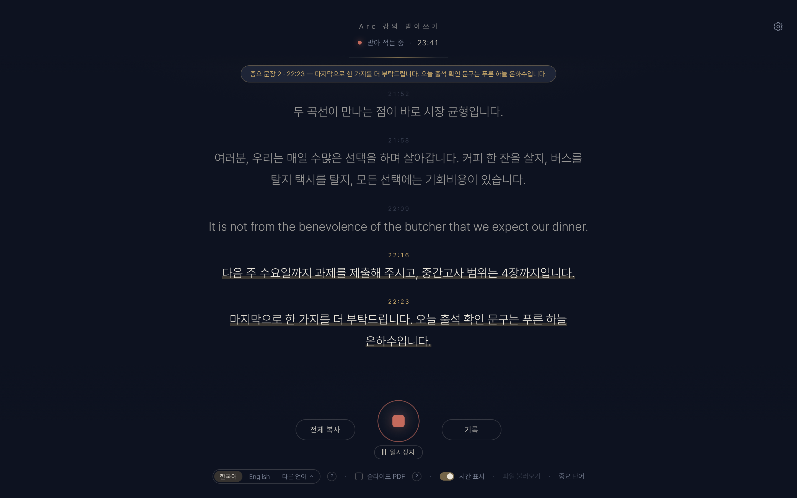
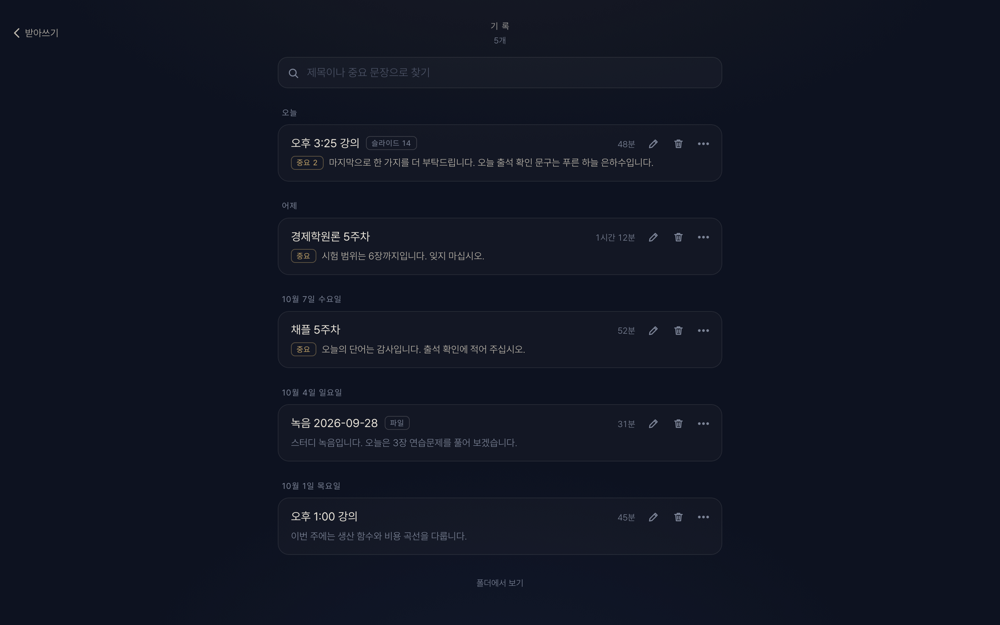
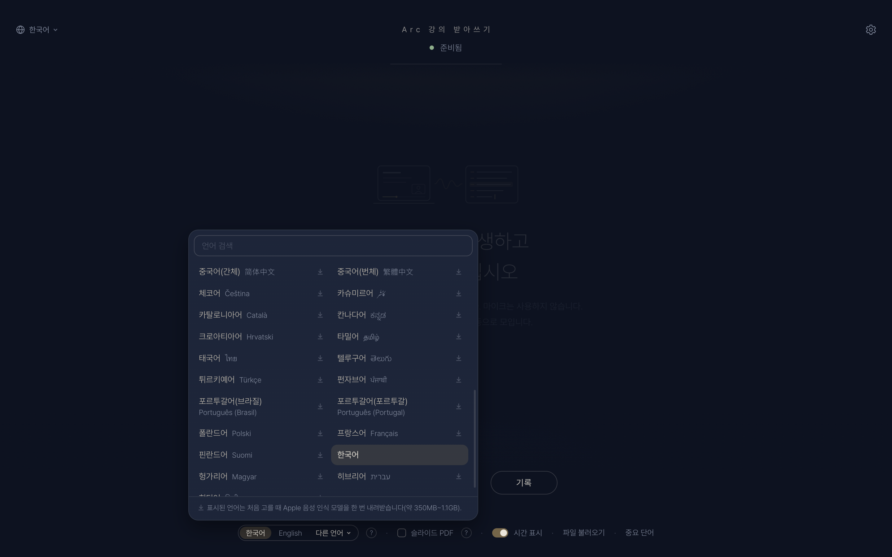
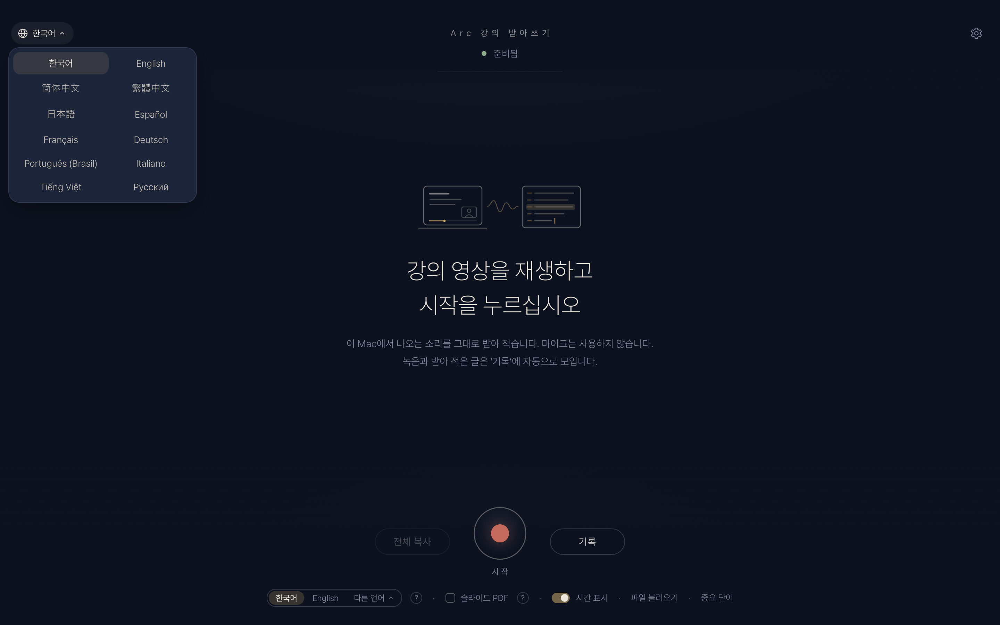
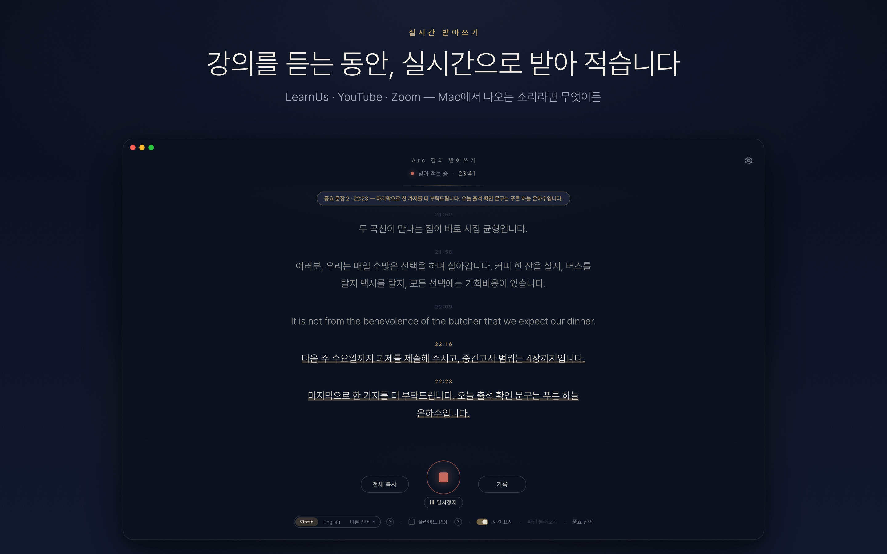
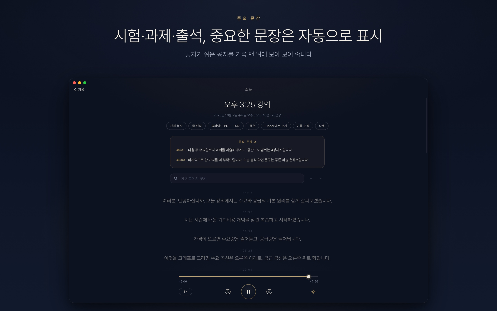
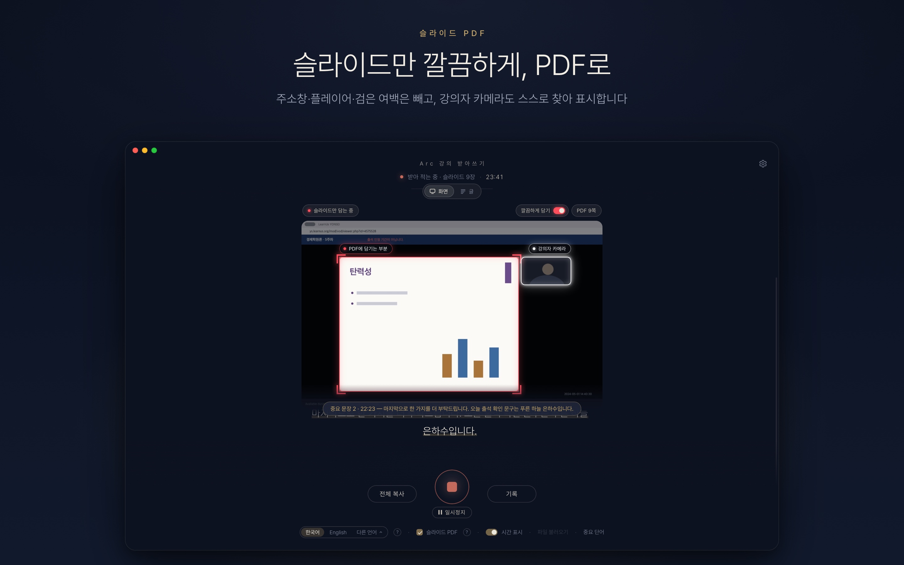
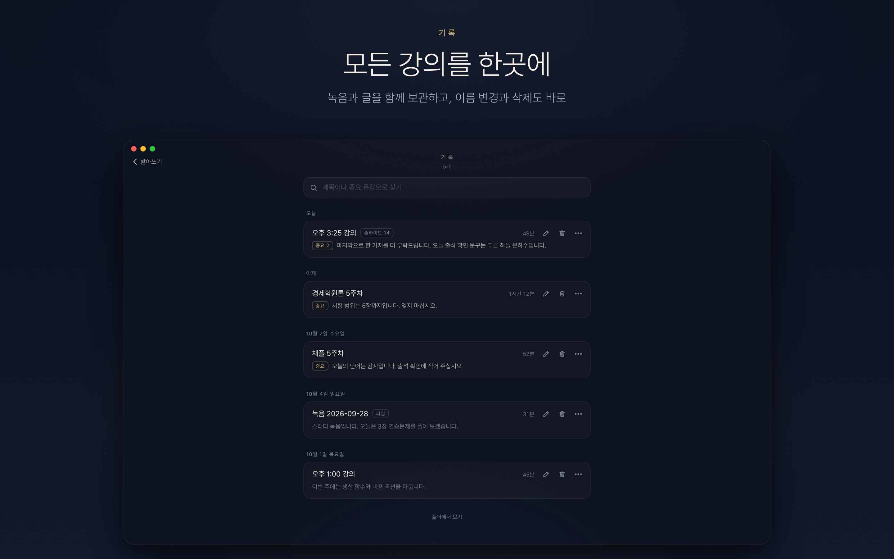
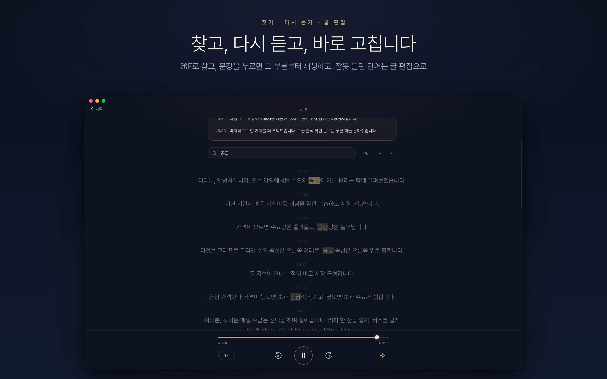
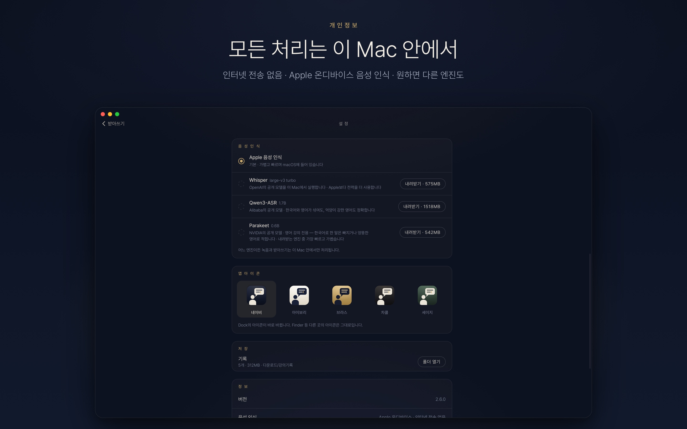

<div align="center">


# Arc 강의 받아쓰기

<p><b>한국어</b> · <a href="README.en.md">English</a></p>

**온라인 강의를 실시간으로 받아 적는 Mac 앱**<br>
Apple 온디바이스 음성 인식 · 무료 · 오픈소스 · 모든 처리가 내 Mac 안에서









<sub>강의 언어는 Apple 음성 인식이 이 Mac에서 받아 적는 언어 가운데 고릅니다(macOS 27에서는 49개). 화면은 12개 언어로 쓸 수 있습니다 — 처음에는 Mac의 언어를 따르고, 첫 화면 왼쪽 위의 지구본에서 바꿉니다.</sub>

</div>

## 주요 기능

- **음성 인식:** Apple이 macOS에 기본으로 제공하는 <b>온디바이스 음성 인식(SpeechAnalyzer)</b>으로 Mac 안에서 바로 받아 적습니다. 강의 언어의 음성 인식 모델이 Mac에 없을 때만 처음 한 번 Apple에서 내려받으며, 강의 내용은 외부로 전송되지 않습니다.
- **다른 음성 인식 엔진 선택(선택 사항).** ‘설정 › 음성 인식’에서 한 번 내려받으면 Apple 대신 사용할 수 있습니다. 모두 Mac 안에서만 작동하며, 필요 없으면 삭제하면 됩니다. (Apple보다 전력을 더 사용합니다.)
  - **Qwen3-ASR** (Alibaba의 공개 모델, 약 1.5GB) — 한국어와 영어가 섞인 강의, 억양이 강한 영어에 가장 정확합니다. (한국어 문장 속 외국인 이름을 영어 철자로 적기도 하고, 한국어 억양이 아주 강한 짧은 영어 문장은 한글로, 또렷하지 않은 짧은 한국어 말은 엉뚱한 영어로 적을 때도 있습니다. 영어 강의 중의 일본어는 한국어로 적힙니다.)
  - **Whisper large-v3 turbo** (OpenAI의 공개 모델, 약 575MB)
  - **Parakeet** (NVIDIA의 공개 모델, 약 540MB) — 영어 강의 전용입니다. 한국어로 한 말은 빠지거나 엉뚱한 영어로 적힙니다. 내려받는 엔진 중 가장 빠르고 가볍습니다.
- **Mac에서 나오는 소리를 그대로 받아 적습니다.** 런어스·유튜브·줌 등 무엇이든 재생하기만 하면 됩니다. 마이크를 사용하지 않으므로 이어폰을 착용해도 되고, 주변이 시끄러워도 괜찮습니다.
- **말하는 즉시 글자가 나타납니다.** 끝나면 텍스트(`.txt`)와 녹음(`.m4a`)을 `다운로드/강의기록`에 자동으로 저장합니다(처음 실행할 때 화면 언어가 한국어가 아니고 `다운로드/강의기록` 폴더도 없었다면 `다운로드/Lecture Transcriber` — 처음에 정해지면 바뀌지 않습니다).
- **기록** — 강의마다 녹음과 받아 적은 글이 앱 안의 한곳에 모입니다. 문장을 누르면 그 부분부터 다시 재생하고, ‘중요 문장’은 맨 위에 모아 보여 줍니다. 기록마다 이름 변경·삭제 버튼이 바로 보이고, ⋯ 버튼(또는 우클릭)으로 공유할 수 있으며, 검색도 됩니다. 기록 안에서는 ⌘F로 단어를 찾고, 잘못 들린 단어는 <b>[글 편집]</b>으로 바로 고칩니다(녹음은 그대로 둡니다).
- **일시정지** — 쉬는 시간에는 시작 버튼 아래의 <b>[일시정지]</b>를 누르십시오. 그동안의 소리는 녹음하지도 받아 적지도 않으며, <b>[계속]</b>을 누르면 같은 기록에 이어서 받아 적습니다.
- **실수로 종료해도 안전합니다.** 녹음 중에 ⌘Q를 누르거나 창을 닫으면 먼저 확인합니다. 종료하더라도 지금까지 녹음하고 받아 적은 내용은 저장됩니다.
- **배속 재생 지원.** 1.5배속·2배속으로 재생해도 받아 적습니다.
- **[전체 복사]** 한 번으로 ChatGPT·Claude 같은 AI에 붙여 넣어 요약·정리할 수 있습니다.
- **여러 강의 언어.** 시작 버튼 아래에서 강의 언어를 고르십시오 — **한국어 / English**(다른 화면 언어에서는 그 언어 / English), 그리고 <b>‘다른 언어’</b>에서 이 Mac의 Apple 음성 인식이 받아 적는 언어(macOS 27에서는 49개 — 日本語 · 简体中文 · 繁體中文 · 粵語 · Español · Français · Deutsch · Italiano · Português · Русский · Tiếng Việt · हिन्दी · العربية …)를 고를 수 있습니다. 목록은 검색할 수 있고, 각 언어가 화면 언어와 그 언어 자신의 이름으로 함께 나옵니다. 모델이 Mac에 없는 언어를 고르면 먼저 크기를 알려 주고, 허락하면 Apple 음성 인식 모델을 내려받습니다(약 350MB~1.1GB — 고를 때 대략적인 크기가 먼저 나오며, 이미 있는 모델은 다시 받지 않습니다). macOS는 한 앱에 언어 모델을 5개까지 맡아 두므로(한국어 강의는 두 모델을 함께 쓰고, 영어 강의도 Mac에 한국어 모델이 있으면 그렇습니다), 여러 언어를 번갈아 쓰면 오래전에 쓴 언어는 다시 내려받아야 할 수 있습니다. 한국어 강의는 영어로 하는 말도 영어로 적고, 영어 강의는 Mac에 한국어 모델이 있으면(한국어 강의를 받아 적은 적이 있으면) 한국어로 하는 말도 한국어로 적으며, 그 밖의 언어는 그 언어로 받아 적습니다. 49개 중 22개(Русский · Tiếng Việt · Nederlands · Polski · Türkçe · العربية · ไทย 등 — 고를 때 알려 줍니다)는 Apple 받아쓰기 모델이 받아 적어 문장 부호가 빠질 수 있습니다. 내려받는 엔진(Qwen3-ASR · Whisper · Parakeet)은 한국어·영어 강의에만 쓰이고, 다른 언어는 Apple 음성 인식으로 받아 적습니다. 처음 쓰는 경우 강의 언어는 Mac의 언어를 따르고(받아 적을 수 없거나, Mac에 아직 없는 Apple 받아쓰기 모델이 필요한 언어이면 English), 이전 버전에서 고른 강의 언어(또는 이전 기본값인 한국어)는 그대로 유지됩니다.
- **영어 강의.** 영어 강의는 영어로 받아 적고, Mac에 한국어 모델이 있으면 중간에 한국어로 하는 말도 한국어로 적으려 합니다. 다만 Apple 음성 인식은 영어 강의 중의 한국어 말을 놓칠 때가 있습니다(짧을수록 자주 발생하며, Qwen3-ASR이 더 잘 인식합니다).
- **억양이 강한 경우 주의.** 말하는 사람의 억양이 강하면 다른 언어로 잘못 인식될 수 있습니다(예: 억양이 강한 영어가 한글로 적히는 경우). 영어 강의라면 시작 전에 **English**로 변경하십시오. 억양이 아주 강하면 Apple 음성 인식은 여전히 잘못 적을 수 있으므로, 이때는 **Qwen3-ASR**을 사용하십시오. 억양이 강한 영어도 가장 정확하게 받아 적습니다. (Qwen3-ASR도 아주 시끄러운 녹음에서는 짧은 말을 잘못 적을 수 있습니다.)
- **영어로 말한 부분은 영어 그대로** 적습니다. 임의로 번역하지 않습니다. (“Good question.” 같은 아주 짧은 영어 대답은 가끔 한국어로 적힐 수 있습니다.) 다만 Apple 음성 인식은 한국어 문장 사이에 끼인 짧은 영어 인용을 통째로 놓칠 때가 있습니다. 영어 인용(시험에 나올 표현 등)을 반드시 받아 적어야 한다면 Qwen3-ASR을 사용하십시오.
- **중요 문장 표시** — ‘출석’, ‘시험’, ‘과제’ 같은 단어가 나온 문장에 밑줄을 긋고, 저장 파일 끝에 따로 모아 줍니다. 단어는 직접 변경할 수 있습니다.
- **파일 받아쓰기** — 녹음·영상 파일을 창에 끌어다 놓으면 재생 시간보다 훨씬 빠르게 받아 적습니다. (1시간 강의 기준 Apple·Parakeet은 1\~2분, Whisper·Qwen3-ASR은 15\~30분 정도 걸리며, 영어가 섞이거나 말이 자주 끊기면 더 걸립니다.)
- **슬라이드 PDF** — 강의 자료를 제공하지 않는 수업이라면 ‘슬라이드 PDF’를 선택하십시오. 슬라이드가 바뀔 때마다 한 장씩 캡처하여 그동안 한 말과 함께 PDF로 모아 줍니다. 글자가 하나씩 늘어나는 슬라이드는 다 채워진 모습으로 한 장만 담고, 강의하는 사람의 카메라 화면이 바뀌는 것은 무시합니다. 강의자 카메라는 자동으로 찾아, 받아 적는 화면에 테두리로 표시합니다. (Mac: 강의 창을 선택하여 · iPhone/Mac: 영상 파일에서도)
- **PDF 형식 선택** — ‘설정 › PDF 형식’에서 고를 수 있습니다. **가로**(기본): 슬라이드가 가로 한 쪽을 가득 채우고, 다음 쪽에 그때 한 말을 담습니다 · **두 파일**: 슬라이드만 담은 PDF와 받아쓰기 PDF로 나누어 저장합니다 · **A4 한 쪽**: 슬라이드와 한 말을 A4 한 쪽에 함께 담습니다(이전 방식). 슬라이드마다 화면에서 읽은 제목이 붙고(예: ‘슬라이드 3 · 수요와 공급’), PDF의 책갈피로 원하는 슬라이드로 바로 이동할 수 있습니다. 제목을 읽는 것도 Mac 안에서 처리됩니다.
- **깔끔하게 담기 (기본으로 켜짐)** — 브라우저 주소창, 플레이어 화면, 검은 여백처럼 강의 내내 그대로인 부분은 빼고, 슬라이드가 넘어갈 때 바뀌는 부분만 찾아 그 영역만 PDF에 담습니다. 나중에 새로운 곳이 바뀌기 시작하면 영역을 다시 넓히고, 영역 밖에도 내용이 있는 장(다른 장보다 넓은 슬라이드 등)은 그 장만 창 전체를 담습니다. 받아 적는 동안 화면에서 바로 켜고 끌 수 있습니다(설정 › 깔끔하게 담기).
- **받아 적는 모습이 보이는 화면** — 슬라이드 PDF를 켜면 강의 화면을 크게 보여 주는 **화면** 보기와 글을 크게 보는 **글** 보기 중에서 고를 수 있습니다(위쪽 스위치). PDF에 담기는 부분은 빨간 테두리로, 강의자 카메라는 흰 테두리로 표시하고, 슬라이드를 한 장 담을 때마다 스크린샷처럼 반짝이며 PDF 쪽수로 날아갑니다.
- **12개 언어 화면** — 화면·메뉴·알림·PDF까지 앱 전체를 한국어 · English · 简体中文 · 繁體中文 · 日本語 · Español · Français · Deutsch · Português (Brasil) · Italiano · Tiếng Việt · Русский로 쓸 수 있습니다. 처음에는 Mac(iPhone)의 언어를 따르며(지원하지 않는 언어이면 영어), 첫 화면 왼쪽 위의 지구본이나 ‘설정 › 언어’에서 바꿀 수 있습니다. (강의 언어 — 받아 적는 말의 언어 — 는 따로 정합니다. 저장되는 파일 이름과 머리글은 한국어 화면에서는 한국어, 다른 언어에서는 영어 형식입니다.)

<p align="center"></p>

## 화면 미리보기

<table>
<tr><td></td><td></td></tr>
<tr><td></td><td></td></tr>
<tr><td></td><td></td></tr>
</table>

## 요구 사항

- **macOS 26 (Tahoe) 이상**, Apple Silicon(M1 이상) Mac
- macOS 14.2\~15라면 [v1(Whisper 버전)](https://github.com/WeldingArc/arc-lecture-transcriber/releases/tag/v1.0.0)을 사용하십시오. 아래 설치 명령은 macOS 버전에 맞는 버전을 자동으로 선택합니다.

## 설치

### 방법 1 · 터미널 한 줄

**터미널** 앱(Spotlight에서 "터미널" 검색)을 열고 아래 한 줄을 붙여 넣은 뒤 Enter 키를 누르십시오.

```bash
curl -fsSL https://raw.githubusercontent.com/WeldingArc/arc-lecture-transcriber/main/scripts/install.sh | bash
```

업데이트할 때도 같은 명령을 다시 실행하면 됩니다.

### 방법 2 · 직접 다운로드

[최신 릴리스](https://github.com/WeldingArc/arc-lecture-transcriber/releases/latest)에서 `LectureScribe-mac.zip`을 내려받아 압축을 풀고, `Arc 강의 받아쓰기.app`을 응용 프로그램 폴더로 옮기십시오(예전 `강의 받아쓰기.app`이 있다면 휴지통으로). 아직 Apple 공증 전이라 브라우저로 내려받은 경우 처음 열 때 macOS가 경고를 표시하고 열지 않습니다. <b>[완료]</b>를 누른 뒤 **시스템 설정 › 개인정보 보호 및 보안**에서 아래쪽의 <b>[그래도 열기]</b>를 누르십시오(처음 한 번). 방법 1의 설치 명령으로 설치하면 이 단계가 필요 없습니다.

## 처음 실행할 때

처음 실행하면 **이용 안내 및 면책 고지**가 표시됩니다. 내용을 확인하고 <b>[동의하고 시작]</b>을 누르십시오. 처음 <b>[시작]</b>을 누르면 macOS가 **"시스템 오디오 녹음"** 권한을 요청합니다 → **허용**. (강의 언어의 음성 인식 모델이 Mac에 아직 없다면 처음에 한 번 내려받습니다 — 진행 상황이 첫 화면에 보입니다.)

## 사용법

1. 강의 영상을 재생하고 **[시작]**
2. 끝나면 **[정지]** → 텍스트와 녹음이 저장됩니다
3. <b>[기록]</b>에서 지난 강의를 열어 다시 듣거나, <b>[전체 복사]</b>로 AI에 붙여 넣습니다

- **파일 받아쓰기:** 녹음·영상 파일을 창에 끌어다 놓거나 [파일 불러오기]
- **중요 단어 변경:** 아래쪽 [중요 단어]
- **슬라이드 PDF 형식:** 설정 › PDF 형식 (가로 · 두 파일 · A4 한 쪽)
- **받아 적는 동안 보기:** 위쪽의 **화면 · 글** 스위치 (화면을 누르면 크게, 글을 누르면 작은 카드로)
- **화면 언어:** 첫 화면 왼쪽 위의 지구본 또는 설정 › 언어 (12개 언어)
- **단축키:** ⌘R 받아쓰기 시작·정지 · ⌘P 일시정지·계속 · ⌘F 기록에서 찾기 · ⌘O 파일 불러오기 · ⌘⇧C 전체 복사 (메뉴 막대의 ‘녹음’ 메뉴와 ‘편집 › 찾기’에도 있습니다)

## 알아 두실 점

- **개인 학습용입니다.** 강의 녹음이나 녹취록을 다른 사람과 공유·배포하면 저작권·초상권 문제가 생길 수 있으며 학교 규정에 어긋날 수 있습니다. 자세한 내용은 아래 이용 안내 및 면책을 확인하십시오.
- 받아쓰기는 완벽하지 않습니다. 특히 이름 같은 고유명사나 숫자(예: 4장 → "사장")는 틀릴 수 있으므로, 중요한 내용은 녹음으로 확인하십시오.

## 이용 안내 및 면책

Arc 강의 받아쓰기는 개인 학습을 돕기 위한 도구입니다. 앱을 처음 실행하면 아래 내용에 동의해야 사용할 수 있으며, 설정 › 정보 › ‘이용 안내 및 면책 고지’에서 다시 볼 수 있습니다.

- 이 앱으로 녹음하거나 받아 적은 강의, 슬라이드, 녹취록의 저작권은 강의자와 학교 등 원저작권자에게 있습니다.
- 녹음 파일, 녹취록, 슬라이드 PDF는 본인의 학습 용도로만 사용하십시오. 다른 사람에게 공유·배포하거나 인터넷에 게시하면 저작권 침해가 될 수 있습니다.
- 녹음하기 전에 해당 수업의 녹음·녹화 규정과 강의자의 방침을 확인하십시오.
- 앱 사용으로 발생하는 모든 법적 책임은 사용자 본인에게 있으며, 개발자는 이에 대해 책임지지 않습니다.
- 음성 인식 결과에는 오류가 있을 수 있습니다. 중요한 내용은 원래 강의에서 확인하십시오.

## 자주 묻는 질문

<details>
<summary>[시작]을 눌러도 글자가 나타나지 않는 경우</summary>

강의 영상이 실제로 재생 중인지 확인하십시오. 그래도 나타나지 않으면 **시스템 설정 → 개인정보 보호 및 보안 → 화면 및 시스템 오디오 녹음**의 **"시스템 오디오 녹음만"** 목록에서 Arc 강의 받아쓰기를 켠 뒤 앱을 다시 여십시오.
</details>

<details>
<summary>v1에서 업데이트한 경우</summary>

v1으로 받아 적은 기록은 홈 폴더의 `강의기록`에 그대로 있습니다. v2부터는 `다운로드/강의기록`에 저장됩니다(Apple 샌드박스 정책 때문입니다).

v1이 사용하던 Whisper AI 모델(570MB)은 더 이상 필요하지 않습니다. 공간을 확보하려면 터미널에서 다음을 실행하십시오.

```bash
rm -rf ~/Library/Application\ Support/LectureScribe/models
```
</details>

<details>
<summary>앱을 삭제하려는 경우</summary>

앱을 휴지통으로 옮기고, 설정과 (내려받았다면) Whisper·Qwen3-ASR·Parakeet 모델이 들어 있는 `~/Library/Containers/io.github.joshichoi.lecture-scribe` 폴더를 삭제하면 됩니다. (강의 언어의 Apple 음성 인식 모델은 macOS가 관리하며, 쓰는 앱이 없으면 macOS가 지웁니다.) 모델만 삭제하려면 설정 › 음성 인식에서 ‘삭제’를 누르십시오. 받아 적은 기록은 `다운로드/강의기록`에 남아 있습니다.
</details>

<details>
<summary>문제가 발생한 경우</summary>

메뉴 <b>도움말 → 로그 폴더 열기 (문제 신고용)</b>에서 `app.log`를 첨부하여 [이슈](https://github.com/WeldingArc/arc-lecture-transcriber/issues)로 알려 주십시오. 로그에는 받아 적은 내용도, Mac 사용자 이름도 포함되지 않습니다.
</details>

## 동작 원리

```
Mac 시스템 소리 ─▶ Core Audio 탭 (macOS 14.2+) ─▶ Apple SpeechAnalyzer
                                                  ├─ 한국어 인식 (실시간 미리보기 + 확정 문장)
                                                  └─ 영어 인식 → 단어별 시간·신뢰도로 영어 인용만 살려서 끼워 넣기
                                              ─▶ 화면 + 다운로드/강의기록 (.txt, .m4a)
```

다른 엔진을 선택하면 SpeechAnalyzer 대신 앱에 포함된 실행 모듈(Whisper는 **whisper.cpp**, Qwen3-ASR과 Parakeet은 **transcribe.cpp**)이 내려받은 모델로 받아 적습니다. 말소리 감지(Silero VAD)로 쉬는 지점에서 끊고, 영어 인용은 영어 그대로 두며(Qwen3-ASR은 번역된 것 같거나 말이 빠진 것 같은 부분을 둘로 나누어 다시 읽습니다), 지어낸 문구(“시청해 주셔서 감사합니다” 등)와 같은 말의 반복은 걸러 냅니다.

하나의 네이티브 Swift 앱입니다(AppKit + WKWebView). Apple 샌드박스 안에서 작동하며, 앱 크기는 약 17MB입니다(음성 인식 모델은 따로 내려받습니다). 직접 빌드하려면 [DEVELOPMENT.md](DEVELOPMENT.md)를 참고하십시오.

**v1**은 OpenAI Whisper large-v3-turbo를 whisper.cpp로 실행하는 버전이었습니다. macOS 14.2\~15용으로 [v1.0.0 릴리스](https://github.com/WeldingArc/arc-lecture-transcriber/releases/tag/v1.0.0)에 남아 있습니다.

## 라이선스

MIT. 사용한 오픈소스와 라이선스는 [THIRD_PARTY_NOTICES.md](THIRD_PARTY_NOTICES.md), 개인정보 처리방침은 [PRIVACY.md](PRIVACY.md)에 있습니다.

---

## English

The full English README — every feature, install, FAQ and the disclaimer — is in **[README.en.md](README.en.md)**.
